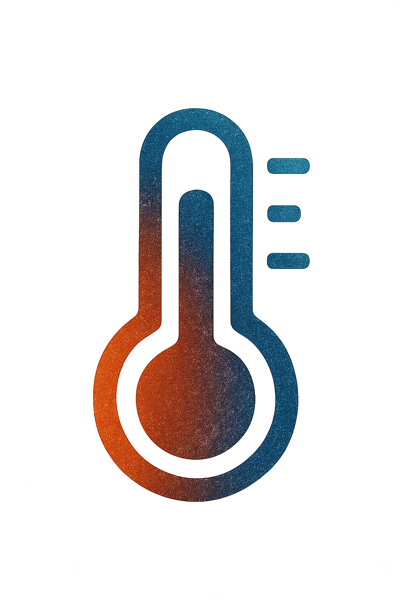

# Acc-Temp

**Acc-Temp** is a Streamlit application designed to systematically support the execution and management of "Heat Acclimatization" to reduce the risk of heatstroke in summer work environments.

## Overview

[cite_start]"**Heat Acclimatization**" is known as an effective countermeasure against heatstroke[cite: 2]. [cite_start]However, according to a survey by the Japanese Red Cross Society, only 12% of people in Japan fully understand its meaning [cite: 2][cite_start], indicating that its importance and proper implementation methods are not widely known[cite: 2].

[cite_start]**Acc-Temp** was developed to solve this issue[cite: 2]. [cite_start]It is a support system that accurately manages the acclimatization status of each worker based on data, facilitating the introduction of planned and safe heatstroke countermeasures[cite: 1, 2].

## Key Features

[cite_start]This system implements the following features to support the execution and management of heat acclimatization[cite: 1]:

-   **1. Acclimatization Plan Management**
    -   [cite_start]Operates the heat acclimatization management system, intended to be used with an attendance and labor system[cite: 1].
    -   [cite_start]At the start of a work shift, it automatically notifies each individual of their recommended work time based on their personal acclimatization progress[cite: 1].

-   **2. Work Restriction Settings**
    -   [cite_start]Calculates a recommended safe work time based on an individual's heat acclimatization progress[cite: 1].
    -   [cite_start]It applies the "20% Rule" recommended by the U.S. Occupational Safety and Health Administration (OSHA)[cite: 1].

-   **3. Record of Implemented Countermeasures**
    -   [cite_start]Records that the company is properly implementing heatstroke countermeasures, which supports proof of its safety management system[cite: 1].

## Background

-   [cite_start]**Cause of Heatstroke**: It occurs when the body accumulates heat due to an imbalance of water and salt, or a breakdown of its thermoregulation functions[cite: 2].
-   [cite_start]**Effective Countermeasure**: "Heat Acclimatization," the process of gradually getting the body used to the heat, is an effective countermeasure that can reduce the risk of heatstroke[cite: 2].
-   [cite_start]**Current Situation in Japan**: Awareness of heat acclimatization is low in Japan, with only 12% of people fully understanding its meaning[cite: 2]. [cite_start]Based on this situation, this system aims to support the execution and management of heat acclimatization[cite: 2].